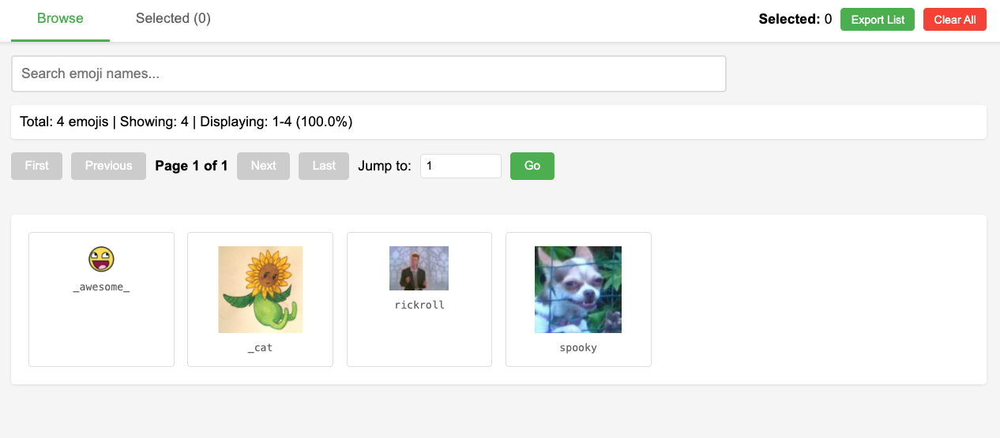

# EmojiBrowser

A web-based emoji browser with pagination, search, and selection tracking. Perfect for browsing large collections of custom Slack emojis or images within a directory.



## Features

- **Pagination**: Browse 50 emojis per page
- **Search**: Filter emojis by name
- **Selection Tracking**: Click emojis to select them (persists across sessions)
- **File Export**: Selected emojis are automatically copied to a `selected/` folder
- **Progress Tracking**: See percentage completion through your emoji collection
- **Tab Interface**: Switch between browsing and viewing selected emojis
- **Grid Builder**: Generate multi-emoji grids for Slack (like big-thinking, big-chungus)

## Setup

### Prerequisites

- Node.js installed on your system
- A folder of emoji images (PNG, JPG, GIF, etc.)

### Quick Start

1. Clone this repository:

   ```bash
   git clone https://github.com/jeffkillian/EmojiBrowser
   cd EmojiBrowser
   ```

2. (Optional) Add your own emoji images to the `emojis/` directory. The repo includes sample images to get you started:

   ```bash
   cp /path/to/your/emoji/images/* emojis/
   ```

3. Run the start script:
   ```bash
   ./start.sh
   ```

That's it! The browser will automatically open to `http://localhost:8000/emoji_browser.html`

### Manual Installation

If you prefer to run the steps manually:

1. Clone this repository:

   ```bash
   cd ~/Development
   git clone https://github.com/jeffkillian/EmojiBrowser
   cd EmojiBrowser
   ```

2. (Optional) Add your own emoji images to the `emojis/` directory. The repo includes sample images to get you started:

   ```bash
   cp /path/to/your/emoji/images/* emojis/
   ```

3. Generate the HTML file with embedded emoji data:

   ```bash
   chmod +x generate_html.sh
   ./generate_html.sh
   ```

4. Start the server:

   ```bash
   node start_server.js
   ```

5. Open your browser to:
   ```
   http://localhost:8000/emoji_browser.html
   ```

## Usage

### Browsing Emojis

- Use the **Browse** tab to view all emojis
- Search by name using the search box
- Navigate pages using First/Previous/Next/Last buttons
- Click any emoji to select it (turns green)
- Click again to deselect

### Viewing Selected Emojis

- Switch to the **Selected** tab to see all selected emojis
- Export a list of selected emoji filenames
- Clear all selections

### Using Selected Emojis

When you select emojis, they are automatically copied to the `selected/` folder in your project directory. You can:

1. Open Finder and navigate to the `selected/` folder
2. Drag files directly from Finder to upload areas (like Slack's emoji upload)

### Creating Multi-Emoji Grids

For emojis that are split into grids (like `big-thinking-11`, `big-thinking-12`, etc.), you can generate Slack-ready text:

Example for a 4x4 grid:

```
:big-thinking-11::big-thinking-12::big-thinking-13::big-thinking-14:
:big-thinking-21::big-thinking-22::big-thinking-23::big-thinking-24:
:big-thinking-31::big-thinking-32::big-thinking-33::big-thinking-34:
:big-thinking-41::big-thinking-42::big-thinking-43::big-thinking-44:
```

Just paste this into Slack to display the full emoji!

## Project Structure

```
EmojiBrowser/
├── README.md              # This file
├── start.sh               # One-command start script
├── start_server.js        # Node.js server
├── index.html             # HTML template
├── app.js                 # JavaScript template
├── generate_html.sh       # Script to generate final HTML and JS
├── emojis/               # Place your emoji images here (not tracked in git)
├── selected/             # Auto-generated folder for selected emojis (not tracked in git)
├── emoji_browser.html    # Generated HTML (not tracked in git)
└── emoji_browser.js      # Generated JavaScript (not tracked in git)
```

## Configuration

### Change Port

Edit `start_server.js` and modify:

```javascript
const PORT = 8000;
```

### Change Items Per Page

Edit `index.html` and modify:

```javascript
const itemsPerPage = 50;
```

## Data Persistence

- Selected emojis are stored in browser localStorage
- Selected emoji files are copied to the `selected/` folder
- Your selections persist across browser refreshes and server restarts

## Troubleshooting

### "emojis directory not found" error

Make sure you've created the `emojis/` directory and added your emoji images to it.

### Images not loading

1. Check that your emoji files are in the `emojis/` directory
2. Make sure you've run `./generate_html.sh` to generate the HTML
3. Restart the server: `node start_server.js`

### Server won't start on port 8000

Another process might be using port 8000. Either:

- Kill the existing process: `lsof -ti :8000 | xargs kill`
- Change the port in `start_server.js`

## License

MIT

## Credits

Built with vanilla JavaScript, no frameworks required!
